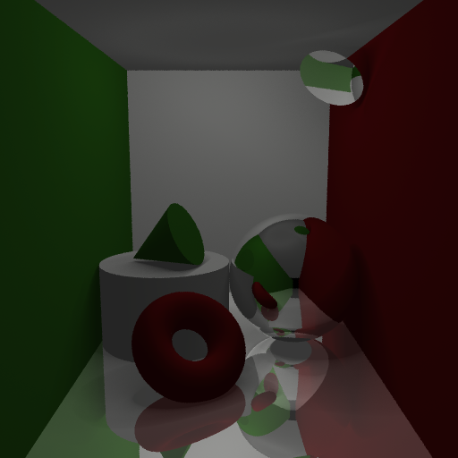
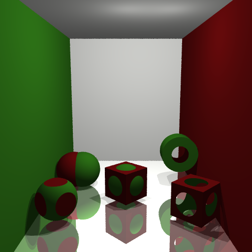
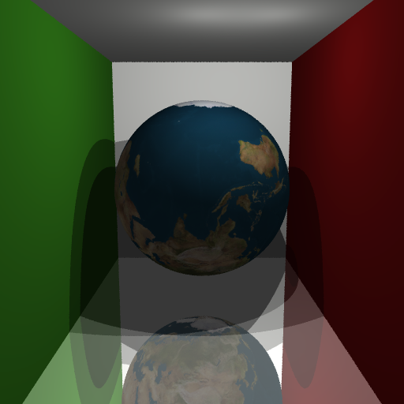

# Ray Tracer

A ray tracer implemented in C++. It traverses a scene graph described by lua scripts.
This was written for an assignment for the CS 488 course at the University of Waterloo.

## Features

### Primitives & Soft Shadows
- Sphere
- Cube
- Polygonal Mesh (faces are assumed to be convex and planar)
- Cone
- Cylinder
- Torus
- Disc

### Constructive Solid Geometry

### Texture Mapping

